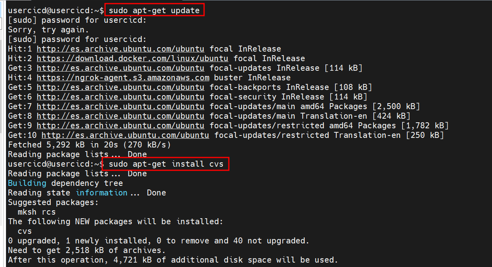
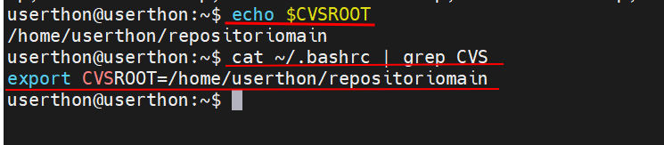
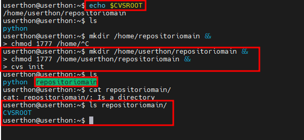
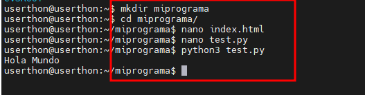
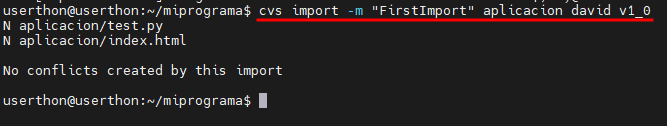
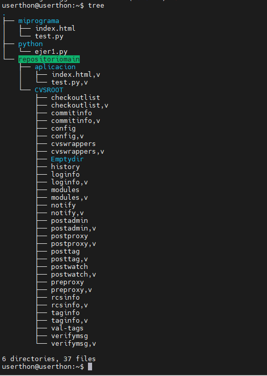
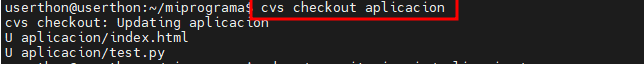
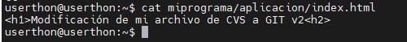
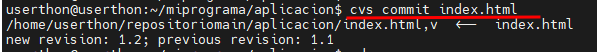
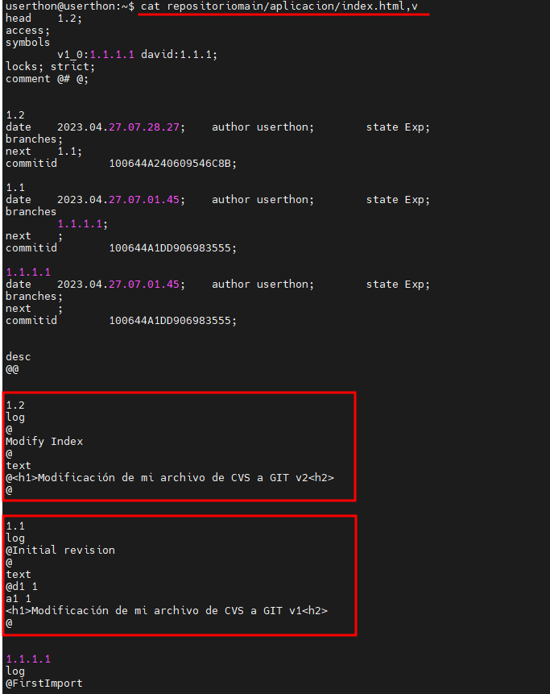

# MigrationCVStoGIT

### Requisitos mínimos:

- Docker
- Bash
- Clave SSH de GitLab
- Servidor Linux (El laboratorio está realizado en Ubuntu)

---
### Objetivo del repositorio

- Tenemos creado un repositorio en CVS y queremos migrarlo en este caso a GitLab

--- 
### Pasos / Tareas
1. Montar un servidor cvs (se puede usar docker)

    Instalación en local.
    https://www.linuxfromscratch.org/blfs/view/5.1/server/cvsserver.html 

    ~~~
    sudo apt-get update 
    sudo apt-get install cvs
    ~~~

    

2. Investigar como crear un repositorio cvs, tras ello crearlo.

    Lo primero que haremos será crear una variables llamada $CVSROOT donde estableceremos la ruta del repositorio, para que esta variables sea fija la meteremos en el *bashrc* del usuario.
    
    ~~~
    export CVSROOT=/home/userthon/repositoriomain
    ~~~
    
    

    A continuación, creamos la carpeta que hemos establecido en el punto anterior, le añadimos unos determinados permisos e iniciamos cvs.

    ~~~
    mkdir /home/userthon/repositoriomain && chmod 1777 /home/userthon/repositoriomain && cvs init
    ~~~

    

    Ya tenemos el repositorio configurado, a continuación, importamos la carpeta de nuestro proyecto donde tenemos un par de archivos.

    

    Por último, importamos el contenido, con el siguiente comando.

    ~~~
    cvs  import -m “FirstImport” aplicacion david v1_0
    ~~~

    

    - Cvs → Comando del control de versiones 
    - Import → Vamos a importar “miprograma” en el repositorio para ello deberemos estar dentro de la carpeta.
    - -M → Añadimos un comentario.
    - Aplicacion → En el repositorio se va a crear una carpeta con el contenido de nuestro programa, entonces “aplicacion” es como se va a llamar nuestro programa en el repositorio.
    - David → Nombre de la persona que ejecuta la acción.
    
    - V1_0 → Se asigna un valor al tag.

    

    La estructura quedaría tal que así.

    

3. Darle contenido ha dicho repositorio (se recomiendan hacer commits)

    ~~~
    cvs checkout aplicacion
    ~~~

    

    A partir de ahora todos los cambios lo realizaremos desde /miprograma/aplicacion
    
    Lo próximo que haremos será un commit, para ello modificamos el index.html

    

    Y por último hacemos un commit.

    ~~~
    cvs commit index.html
    ~~~

    

    Finalmente nos dirigimos a nuestro repositorio y hacemos un cat al archivo.v para corroborar que se ha creado correctamente el commit.

    

4. Investigar cómo funciona la herramienta cvs-fast-export.

    Convierte y exporta repositorios CVS usando el formato de exportación rápida de Git, produciendo una salida adecuada para importar a Git. Es rápido, determinista y completo, lo que lo convierte en una buena alternativa al comando integrado cvsimport de Git.

5. Instalarse cvs-fast-export (no vale con apt install pues la versión de los repositorios es antigua. Se recomienda descargarse el código del repositorio oficial y compilarlo)

    Clonamos el repo

    Primero ejecutamos la instalación de los paquetes necesarios.

    Compilamos

    Ya tendríamos el programa.

    Para tener el comando global e instalado en la máquina cogeremos el siguiente comando

    sudo install cvs-fast-export /usr/local/bin/cvs-fast-export
    Generamos un archivo con un determinado formato con la herramienta cvs-fast-export.

6. Instalar gitlab en docker (edicio ce). Se recomienda usar docker-compose.

    Primero instalamos docker

    https://www.czerniga.it/2021/11/14/how-to-install-gitlab-using-docker-compose/ 

    
    Ya tenemos GitLab funcionando para saber las credenciales entramos en la máquina en la siguiente ruta.

    Añadimos un usuario nuevo
    
    Para las pruebas y las subidas de los distintos repositorios usaremos el usuario creado anteriormente.

7. Migrar el repositorio de cvs a git
Creación de clave.

    Añadimos la clave a GitLab.

    Creamos un nuevo repositorio.

    Instalamos git-cvsimport para pasar de un repo en cvs a uno en gitlab.

8. Automatizar el séptimo paso con un script de python. Al lanzar este script se debe crear un repositorio en el gitlab y subir el repositorio migrado. Los parámetros de este script pueden ser los que queráis.

    El script de *crearepocvs.py* permite crear un repositorio en CVS a partir de una carpeta donde esté el contenido que se desa subir.

    El segundo script *migrationcvs.py* permite migrar el repositorio de CVS a GitLab.
